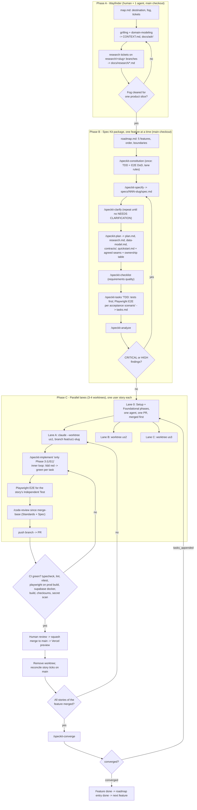

# 07 Research: Combining Spec Kit and Matt Pocock's skills for parallel agents

Ticket: `.scratch/typing-race-hackathon/issues/07-speckit-pocock-workflow-research.md`
Researched: 2026-09-13. Primary sources: local clones `spec-kit/` (github/spec-kit) and `skills/` (mattpocock/skills), the skills actually installed in `.agents/skills/`, `.specify/`, and the Claude Code docs at code.claude.com. Every claim is cited in §11.

## 1. Summary

**One pipeline, two owners.** Wayfinder owns everything *before* a spec exists (fog, decisions, research); Spec Kit owns the spec → plan → tasks → implement → converge artifact chain; Pocock's *practice* skills (`tdd`, `code-review`, `diagnosing-bugs`, `codebase-design`, `domain-modeling`) are called *inside* Spec Kit steps, never as a parallel artifact chain. The three Pocock skills that would duplicate Spec Kit artifacts — `to-spec`, `to-tickets`, `implement-spec` — are **not used for the build**; their good ideas (agreed seams, tracer-bullet vertical slices, frontier scheduling) are folded into the Spec Kit artifacts instead.

Ten decisions that follow:

1. **Canonical spec** = `specs/<NNN>-<slug>/spec.md` from `/speckit-specify`. `to-spec` is dropped (it would publish a second, competing spec into `.scratch/`).
2. **Canonical task graph** = `tasks.md` from `/speckit-tasks`. `to-tickets` is dropped, but its vertical-slice rule drives how we cut user stories (§7).
3. **The parallel unit is the user-story phase, not the `[P]` task.** One story = one lane = one worktree = one branch = one PR. `[P]` is an intra-lane hint only (§6).
4. **Setup + Foundational phases are single-lane and merge first.** Spec Kit itself marks Foundational as "BLOCKS all user stories"; that checkpoint is our fan-out point.
5. **TDD must be requested explicitly.** Spec Kit emits test tasks only "if explicitly requested in the feature specification or if user requests TDD approach", so the DoD lives in the constitution *and* is restated in each `/speckit-specify` and `/speckit-tasks` call (§4, §5).
6. **Three distinct review gates, no overlap:** `/speckit-analyze` (artifacts, before implementing), `/code-review` (the diff, per PR), `/speckit-converge` (code vs spec, once per feature).
7. **No agent-run merges.** `implement-spec`'s "implementer subagents + merger subagents" is replaced by human-approved PR → CI → squash merge. Its nesting is also what exhausted the usage limit on the first attempt at this ticket.
8. **Five Spec Kit features, not one**, tied together by a roadmap file — the "spec of specs" pattern Spec Kit documents for exactly this case (§7).
9. **Switch the Spec Kit integration from `agy` to `claude`, keep `--script ps`**, and do *not* install the Spec Kit `git` extension (§8).
10. **`tasks.md` is the single source of build state.** GitHub issues are at most a one-way public mirror created once per feature via `/speckit-taskstoissues`; `triage` is reserved for post-demo incoming reports.

## 2. Tool inventory

### 2.1 Spec Kit (assets v1.0.1; CLI 1.0.5.dev0; integration `agy`)

Documented order: `constitution → specify → clarify → plan → checklist → tasks → analyze → implement → converge`, of which "only `/speckit.specify` is strictly required before `/speckit.plan`. The clarify, checklist, and analyze commands are quality gates you add for anything with meaningful ambiguity" (`spec-kit/docs/reference/agentic-sdd.md`).

| Command | Writes | What matters here |
|---|---|---|
| `speckit-constitution` | `.specify/memory/constitution.md` | Non-negotiable input to `analyze`: constitution conflicts are automatically CRITICAL |
| `speckit-specify` | `specs/<NNN>-<slug>/spec.md`, `checklists/requirements.md` | Creates the feature dir. **Branch creation is optional** and happens only through the git extension's `before_specify` hook; "the spec directory name and the git branch name are independent" |
| `speckit-clarify` | edits `spec.md` + requirements checklist | ≤5 targeted questions per run, repeatable |
| `speckit-plan` | `plan.md`, `research.md`, `data-model.md`, `contracts/`, `quickstart.md` | Phase 0 research, Phase 1 design; stops after design |
| `speckit-checklist` | `checklists/<name>.md` | "unit tests for your requirements"; reviewer-owned; a read-only gate for `implement` |
| `speckit-tasks` | `tasks.md` | Phases: Setup → Foundational → one phase per user story (P1, P2…) → Polish; strict `- [ ] T001 [P] [US1] description with file path` format |
| `speckit-analyze` | nothing (report only) | "STRICTLY READ-ONLY"; duplication / ambiguity / coverage / constitution passes; CRITICAL–LOW severities |
| `speckit-implement` | code + `[X]` marks in `tasks.md` | Reads checklists as a read-only gate; phase-by-phase; "Follow TDD approach: Execute test tasks before their corresponding implementation tasks"; accepts free-form scoping arguments |
| `speckit-converge` | appends `## Phase N: Convergence` to `tasks.md`, nothing else | "APPEND-ONLY, NEVER REWRITE"; "no git, no branch comparison, no history"; outcome `converged` or `tasks_appended` |
| `speckit-taskstoissues` | GitHub issues | Needs a GitHub remote **and the GitHub MCP server**; one issue per task titled `T001: <description>`; dedupes by task ID; sets no labels and no blocking edges |

Feature state is **not** the git branch: `create-new-feature.ps1` writes `.specify/feature.json` and exports `SPECIFY_FEATURE` / `SPECIFY_FEATURE_DIRECTORY`; `common.ps1` resolves the feature dir from the env var first, then from `feature.json`. `.specify/.gitignore` ignores `feature.json` as "per-checkout state rather than something to share" — which is exactly what makes one-feature-per-worktree safe.

Not installed here: `.specify/extensions.yml` does not exist, so **no hooks, no auto-commit and no auto-branching run today**. The bundled `git` extension would add `before_specify → speckit.git.feature` (branch creation) plus `after_*` auto-commits.

### 2.2 Matt Pocock's skills (installed in both `.agents/skills/` and `.claude/skills/`)

| Skill | Shape | Artifact |
|---|---|---|
| `wayfinder` | HITL planning loop over a map + decision tickets | `.scratch/<effort>/map.md`, `issues/NN-*.md` |
| `grilling` / `grill-with-docs` | HITL interrogation | none (feeds other artifacts) |
| `domain-modeling` | HITL | `CONTEXT.md`, `docs/adr/` |
| `research` | AFK background agent against primary sources | one Markdown file in-repo (this file) |
| `prototype` | HITL throwaway | rough code/UI to react to |
| `to-spec` | synthesis of the current conversation, no interview | a spec published to the tracker, labelled `ready-for-agent` |
| `to-tickets` | vertical tracer-bullet slices with blocking edges | `.scratch/<slug>/issues/NN-*.md` |
| `triage` | issue state machine (`needs-triage`, `needs-info`, `ready-for-agent`, `ready-for-human`, `wontfix`) | labels + agent briefs |
| `tdd` | red→green loop; seams agreed with the user up front | tests |
| `implement` | thin wrapper: "Use /tdd … then /code-review … commit" | code |
| `implement-spec` | orchestrator: branch + draft PR, implementer subagents in worktrees, merger subagents, frontier scheduling | a PR |
| `code-review` | two parallel sub-agents: Standards (repo docs + Fowler smell baseline) and Spec | a two-axis report |
| `diagnosing-bugs` | structured diagnosis loop | fix + regression test |
| `codebase-design` | shared vocabulary for deep modules, seams, adapters | none |
| `handoff` / `claude-handoff` | compaction to a doc / to a background `claude --bg` agent | temp-dir doc / new session |

## 3. Overlap/conflict table with canonical choice

| Step | Spec Kit | Pocock | Canonical here | Why |
|---|---|---|---|---|
| Pre-spec fog, decisions | — | **`wayfinder`** (+ `grilling`, `domain-modeling`, `research`, `prototype`) | Wayfinder | Spec Kit assumes you already know what the feature is. Wayfinder is the only tool that models "not yet specifiable" (fog / `Not yet specified`) and is already the project's planning surface. |
| Feature spec | `speckit-specify` (+ `clarify`, `checklist`) | `to-spec` | **`speckit-specify`** | Everything downstream (`plan`, `tasks`, `analyze`, `implement`, `converge`) reads `spec.md` from `FEATURE_DIR`; a `to-spec` doc in `.scratch/` is invisible to all of them and creates two "current" specs. `to-spec`'s unique value — *agree the test seams before writing anything* — is preserved by recording seams in `plan.md` (§4). |
| Clarification | `speckit-clarify` (≤5 questions, written back into the spec) | `grilling` / `grill-with-docs` (open-ended) | **Both, in order:** grill during wayfinder, `clarify` after `specify` | Different acts: grilling surfaces decisions with a human; `clarify` closes residual ambiguity *inside the spec file* and updates `checklists/requirements.md`. |
| Task breakdown | `speckit-tasks` | `to-tickets` | **`speckit-tasks`** | `tasks.md` is machine-read by `implement`, `analyze`, `converge` and `taskstoissues`; the `[P]`/`[US]`/file-path format is the contract. A parallel ticket set under `.scratch/` is double bookkeeping. Borrow `to-tickets`' rules — tracer-bullet vertical slices, and expand–contract for wide mechanical refactors — when choosing user stories. |
| Issue mirror | `speckit-taskstoissues` | `triage` | **`taskstoissues`, optional, once per feature**; `triage` only post-demo | Opposite directions: `taskstoissues` *exports* an existing task graph to GitHub (GitHub MCP server required, no labels, no blocking edges); `triage` *imports* unstructured requests into a state machine. During the build there are no external reporters, so triage has no input. |
| Execution | `speckit-implement` | `implement` / `implement-spec` | **`speckit-implement`, scoped to one phase/story per session, with `/tdd` inside** | Only `speckit-implement` reads the checklist gate, respects phase order and marks `[X]`. Spec Kit's own guidance for big features is to scope each run ("only execute the Setup phase, then stop") and optionally delegate `[P]` tasks to sub-agents. `implement`'s body (use `/tdd`, then `/code-review`, then commit) becomes our per-task loop. **`implement-spec` is rejected**: it opens a draft PR, runs implementer subagents and *merger subagents* that merge into the PR branch automatically — incompatible with protected `main`, human squash-merge and "a green CI run per task", and its nesting is what blew the usage limit on the first run of this ticket. Its *frontier* idea is kept, driven by the human across worktrees. |
| Artifact consistency | `speckit-analyze` | — | **`speckit-analyze`** | Read-only cross-artifact check (spec ↔ plan ↔ tasks ↔ constitution) with severities; nothing in the Pocock set does this. Run before implementing and after any regeneration of `tasks.md`. |
| Diff review | — | **`code-review`** | `code-review` | Spec Kit has no diff-aware review. `code-review` pins a fixed point, diffs `<point>...HEAD` and reports Standards (repo docs + Fowler smell baseline) and Spec axes separately, deliberately un-merged. Run it in the lane session before opening the PR. |
| "Is the feature actually built?" | `speckit-converge` | — | **`speckit-converge`, once per feature** | Assesses the present codebase against spec/plan/tasks ("not a diff tool… no git, no branch comparison") and appends the gaps as tasks. It overlaps `code-review`'s Spec axis only superficially: converge reads the *codebase*, code-review reads a *diff*. |
| Bug work | — | `diagnosing-bugs` | `diagnosing-bugs`, then a task appended to `tasks.md` | Keeps bug fixes inside the same task ledger instead of a side channel. |
| Session handoff | — | `handoff` / `claude-handoff` | **Artifacts first**; `handoff` only for a lane that must survive a context reset | `[X]` marks, the PR body and commits already carry state. `claude-handoff` spawns a `claude --bg` background agent — avoid on this budget. |

**Net effect:** of the Pocock set, three skills are retired for the build (`to-spec`, `to-tickets`, `implement-spec`), one is deferred (`triage`), and the rest keep a job nothing else does.

## 4. Proposed end-to-end workflow (wayfinder → merged task)



Notes on the diagram:

- **The A → B boundary** is wayfinder's own rule: "The pull to just do the work is usually the signal you've reached the edge of the map and it's time to hand off." The map's declared destination already *is* an implementation-ready Spec Kit package.
- **The B7 loop**: Spec Kit says to fix analyze findings "at the source" — `specify`/`clarify` for requirement problems, `plan` for design problems, `tasks` to regenerate — and to re-run until clean.
- **E1 scoping** uses the documented free-form argument ("only execute the Setup phase, then stop"), Spec Kit's cheapest defence against context exhaustion mid-implementation.
- **The G3 loop**: converge either leaves `tasks.md` byte-for-byte unchanged (done) or appends a Convergence phase whose tasks re-enter the same lane → PR → CI cycle.

### Where TDD and the E2E Definition of Done plug in

Spec Kit will *not* generate tests unless asked: "**Tests are OPTIONAL**: Only generate test tasks if explicitly requested in the feature specification or if user requests TDD approach." Three insertion points, all cheap:

1. **Constitution (once).** Encode the DoD as MUST principles: red-green-refactor for domain logic; a Playwright E2E test for every user-visible acceptance scenario against the production build; server features tested against local Supabase in Docker; a green CI run before merge. This is mechanical, not decorative: `/speckit-analyze` treats a constitution MUST violation as **CRITICAL**, so a story phase with no test tasks fails the gate before anyone writes code.
2. **Spec + plan.** Put the DoD in the spec's success criteria, and record in `plan.md` the **agreed seams** (`tdd`: "Test only at pre-agreed seams… No test is written at an unconfirmed seam") plus the file-ownership table (§6). This is where `to-spec`'s seam-sketching step survives; `codebase-design` supplies the vocabulary.
3. **Tasks + implement.** Pass the TDD request explicitly to `/speckit-tasks`; the generated story phase then orders `Tests → Models → Services → Endpoints → Integration`, and `/speckit-implement` is told to "Execute test tasks before their corresponding implementation tasks". Inside each task the lane agent runs the `/tdd` loop (one seam, one failing test, minimal implementation; refactoring deferred to review).

Per-story E2E anchor: every user-story phase in `tasks.md` carries an **"Independent Test"** line ("How to verify this story works on its own") and a **Checkpoint**. Use that line verbatim as the Playwright spec title — the DoD then becomes auditable from `tasks.md` alone, and it is exactly what `speckit-converge` looks for afterwards.

## 5. Role × skill × artifact matrix

Roles are the five already declared in `AGENTS.md`/`CLAUDE.md`; in practice one human plus one Claude session per lane wears one hat at a time.

| Role | Owns (phase) | Skills it may call | Writes | Must not touch |
|---|---|---|---|---|
| **Architect & Spec** (`agent:architect`) | A + B, main checkout only | `wayfinder`, `grilling`, `grill-with-docs`, `domain-modeling`, `research`, `prototype`, `codebase-design`, `speckit-constitution/specify/clarify/plan/checklist/tasks/analyze` | `.scratch/**`, `specs/**`, `docs/adr/**`, `CONTEXT.md`, `.specify/memory/constitution.md`, `docs/research/**` | `src/**` — no application code before the package is approved |
| **Lane 0 / Foundation** (first lane) | Setup + Foundational phases | `speckit-implement` (scoped), `tdd`, `code-review` | shared config: `package.json`, `tsconfig`, Tailwind/tokens, Vite, CI workflow, bootstrap migration, test harness | user-story code |
| **Core Logic & TDD** (`agent:logic-tdd`) | one story lane | `speckit-implement` (scoped to its `[US]`), `tdd`, `codebase-design`, `diagnosing-bugs`, `code-review` | `src/domain/**`, `src/lib/**`, its own `tests/**` | other lanes' trees, shared config |
| **UI & Design** (`agent:ui-stitch`) | one story lane | same set + `prototype`, Claude Design | `src/ui/<story>/**`, its own `e2e/<story>.spec.ts` | design tokens once Lane 0 freezes them |
| **Backend & Supabase** (`agent:backend-supabase`) | one story lane | same set | `supabase/migrations/<timestamp>_<story>.sql`, `src/server/**` | other lanes' migrations |
| **Quality Gate & Judge** (`agent:judge-qa`) | the gates | `code-review`, `speckit-analyze`, `speckit-converge`, `speckit-checklist` | review reports, appended Convergence tasks, checklists | application code — it reports, never fixes |
| **Human (lead)** | every gate | — | merge decisions, tick reconciliation on `main`, roadmap status | — |

Artifact ownership — one writer per artifact is the rule that keeps lanes from colliding:

| Artifact | Single writer | Read by |
|---|---|---|
| `.scratch/typing-race-hackathon/map.md` + tickets | Architect, one claimed ticket per session | everyone |
| `.specify/memory/constitution.md` | Architect (rare, versioned) | `analyze`, all agents |
| `specs/<feature>/spec.md`, `plan.md`, `contracts/`, `data-model.md` | Architect | lanes, read-only during implementation |
| `specs/<feature>/tasks.md` | written by `speckit-tasks`; lanes tick only their own `[US]` lines; `converge` appends | everyone |
| `specs/roadmap.md` | Architect / human | everyone |
| `docs/research/*.md` | one research agent per file, own branch | everyone |
| `CONTEXT.md`, `docs/adr/*` | `domain-modeling` sessions only | everyone |
| application code | exactly one lane per directory (§6) | — |

## 6. Parallel lanes, file ownership and worktrees

### 6.1 What `[P]` actually promises

`[P]` means "different files, no dependencies on incomplete tasks" *inside one phase*. The template is explicit that team-level parallelism lives one level up: "Once Foundational phase completes, all user stories can start in parallel (if team capacity allows)… Different user stories can be worked on in parallel by different team members."

| Spec Kit construct | Our unit | Concurrency |
|---|---|---|
| Phase 1 Setup | Lane 0 | sequential, first, alone |
| Phase 2 Foundational | Lane 0 | sequential — "No user story work can begin until this phase is complete" |
| Phase 3+ `[US1]`, `[US2]`, `[US3]`… | one lane each | 3–4 concurrent worktrees |
| `[P]` inside a story phase | batching hint for the single agent in that lane | never split across lanes |
| Final Polish phase | Lane 0 / human, after all stories merge | sequential |

**Rule: never hand two `[P]` tasks from the same story to two different lanes.** `[P]` guarantees file-disjointness *within the phase as generated*; it says nothing about how two branches merge, and two lanes editing the same story's `tasks.md` block and shared imports is exactly how conflicts start.

### 6.2 Worktrees

Claude Code's documented one-liner is `claude --worktree <name>`: "Each git worktree is a separate checkout on its own branch… Run the same command with a different name in a second terminal to start an isolated parallel session." Isolation is enforced, not merely conventional — while a session is in a worktree, Claude Code **blocks** edits targeting the main checkout, commands whose working directory resolves there, and git redirects into it (`-C`, `--git-dir`, `GIT_DIR`); the same checks cover every subagent that session spawns.

Setup for this repo:

- `.claude/worktrees/` belongs in `.gitignore` (the docs recommend exactly this; it is currently untracked in the main checkout).
- Add a root `.worktreeinclude` so each new worktree gets the gitignored files it needs — at minimum `.env.local` and `.specify/feature.json`. Only files that match a pattern *and* are gitignored are copied.
- Each lane needs the right **active feature**: Spec Kit resolves it from `SPECIFY_FEATURE_DIRECTORY`, else `.specify/feature.json`, which is deliberately per-checkout. Spec Kit's own guidance agrees: "To build independent slices in parallel, use separate worktrees so each run has isolated active-feature state."
- A worktree is a fresh checkout — install dependencies and Playwright browsers in it before running tests.
- Cleanup: exiting an interactive session prompts to keep or remove; otherwise remove the worktree with git (forcing it if dirty). A periodic sweep removes agent and background-session worktrees after `cleanupPeriodDays`.
- Worktrees share the repository's `.git`, project-scope plugins and saved permission approvals with the main checkout — an approval granted in one lane applies everywhere — and the **stash stack is shared**, so lanes must never use bare stash/pop.

### 6.3 File-ownership rules (write these into each feature's `plan.md`)

1. **One directory tree per story.** `/speckit-tasks` requires an exact file path on every task, so the ownership table is derivable mechanically: group the paths under each `[US]` label and assert they are disjoint. If they are not, the stories are not independent — fix that at `/speckit-tasks` (or back at `/speckit-specify`) before any lane starts.
2. **Hot files belong to Lane 0 only**: `package.json`, the lockfile, `tsconfig*`, Vite/Tailwind config, design tokens, the CI workflow, the root router, the shared store index, `AGENTS.md`/`CLAUDE.md`. If a story genuinely needs a change there, it becomes a Foundational-phase task for Lane 0, not a drive-by edit in a lane.
3. **Prefer adding files to editing shared ones**: one migration file per lane (`<timestamp>_<story>.sql`), one i18n namespace per story, one Playwright spec per story; avoid central barrel/registry files, or make them append-only lists whose order does not matter.
4. **`tasks.md` discipline.** It is the hottest shared file because `/speckit-implement` marks `[X]` as it goes. Lanes tick **only lines inside their own story phase**, so conflicts stay line-disjoint and the standing resolution rule is "keep both sides"; the human reconciles on `main` after each squash merge. Stricter fallback if it still gets noisy: lanes do not tick at all and the human ticks the whole story block at merge time.
5. **Rebase before opening the PR**, never merge `main` into a lane branch — squash-merge history stays linear and the `code-review` fixed point (`merge-base`) stays meaningful.
6. **No cross-lane imports of unmerged code.** A lane depends only on what is already on `main` (Lane 0's foundation). If story B needs story A's module, the stories were mis-cut: mark B blocked and run it after A merges. This is the frontier rule from `to-tickets`/`implement-spec`, applied by the human instead of an orchestrator agent.
7. **Subagent hygiene inside a lane.** `code-review` spawns two parallel sub-agents by design — fine in the lane's own session. Do not nest further: no `implement-spec`, no `claude-handoff`, no research subagents from inside a lane. Claude Code permits 20 concurrent subagents and three levels of nesting by default; the binding limit for us is the usage budget, not the tool.

### 6.4 Review and merge gates

| Gate | Where | Tool | Pass condition |
|---|---|---|---|
| G0 Artifacts | main checkout, per feature | `/speckit-analyze` | no CRITICAL, no unaddressed HIGH |
| G1 Requirements quality | main checkout, per feature | `/speckit-checklist` | reviewer has ticked the items (a read-only gate for `implement`) |
| G2 Story implementation | lane worktree | `/tdd`, full Vitest run, Playwright | all story tasks done, Independent Test passes locally |
| G3 Diff review | lane worktree, before the PR | `/code-review <merge-base>` | both axes reported; each finding fixed or explicitly waived in the PR body |
| G4 CI | PR | GitHub Actions | typecheck, lint, Vitest, Playwright (Chromium/Firefox/WebKit on the production build), Supabase-in-Docker suite, build, dictionary checksums, secret scan — all green |
| G5 Merge | PR | human | squash merge, Conventional Commit subject referencing `T###`/`US#`; branch and worktree removed |
| G6 Feature closure | main checkout | `/speckit-converge` | reports `converged`; otherwise the appended Convergence tasks re-enter at G2 |

Handoff conventions between agents, deliberately thin:

- **Context pointers, not copies.** A lane is started with: feature directory, story id, the ownership-table lines it owns, branch name. It reads everything else itself. (`implement-spec`: "Communication to and from subagents should be sparse. Communicate primarily through context pointers".)
- **The PR body is the handoff document**: story id, tasks covered, Independent Test, `code-review` summary, CI run link. A task closes only with a link to a green run.
- **Wayfinder tickets keep the decision trail**: resolve with an `## Answer`, set `Status: resolved`, append a one-line gist plus link to the map's Decisions-so-far. Never resolve more than one ticket per session (research tickets excepted).
- **Cross-lane messages: none.** Lanes communicate through `main`. Claude Code does offer cross-session messaging and experimental agent teams, but teams are disabled by default, cost significantly more tokens, cannot resume in-process teammates, and their own advice is "Avoid file conflicts: break the work so each teammate owns a different set of files" — which our worktree + ownership rules already do, more cheaply.

## 7. Feature split proposal: five features, one roadmap

**Recommendation: five Spec Kit features tied by a roadmap file, not one giant feature.**

Spec Kit's own escalation ladder for large features is: (1) scope each `implement` run to a few tasks or one phase, (2) delegate `[P]` tasks to sub-agents, (3) combine both, (4) "**Decompose the Feature Into Smaller Specs** … Each sub-feature gets its own `spec.md`, `plan.md`, and `tasks.md`, and runs through its own specify/plan/tasks/implement cycle", documented as the "spec of specs" pattern. It warns that decomposition "adds the most overhead", so the deciding argument has to be concrete. Here it is: our parallelism is *branch-level*, and `tasks.md` is per-feature. One feature means 3–4 lanes ticking checkboxes in one file for weeks; five features mean each lane usually touches a *different* `tasks.md`. Decomposition is not overhead for us, it is the conflict-avoidance mechanism. Spec Kit also handles multiple features natively: `specs/` is numbered sequentially (`feature_numbering: sequential` in `.specify/init-options.json`), the active feature is per-checkout state, and the constitution is shared across all of them.

Proposed roadmap (`specs/roadmap.md`, using the documented table shape with immutable IDs and back-references from each sub-spec's `Input` line):

| ID | Feature dir | Intent | Scope boundary | Depends on |
|---|---|---|---|---|
| R1 | `001-typing-core` | App shell, design tokens, keyboard model (ЙЦУКЕН/QWERTY), keystroke engine, SPM/CPM/WPM + accuracy + error counting, Stage 1 scales, zero-peek mode, local progress | No dictionaries beyond a seed list, no auth, no races | — |
| R2 | `002-dictionary-pipeline` | Licensed dictionary ingestion, checksums/licence manifest, filtering by unlocked keys, n-gram/morpheme generation for Stages 2–3 | Generation only; the Academy UI is R4 | R1 |
| R3 | `003-accounts-and-sync` | Mandatory Supabase auth (Resend SMTP), RLS, local↔cloud progress merge, export/import | No leaderboards (R5) | R1 |
| R4 | `004-academy-and-analytics` | Stage 3 Academy, adaptive slow-bigram generator, heatmaps, rhythm/error visualisation, feedback | Uses R2's generator and R3's stored history | R2, R3 |
| R5 | `005-races-and-leaderboards` | Lobbies, Realtime broadcast, race state machine, group leaderboards | Requires accounts from R3 | R3 |

Sequencing for 3–4 lanes: R1 alone (it *is* the foundation) → R2 and R3 in parallel (two features, two worktrees, disjoint trees) → R4 and R5 in parallel. Inside each feature, Lane 0 then one lane per user story (§6). If a slice still turns out too big, the documented answer is to recurse — give it its own roadmap — but prefer cutting a user story out of it first.

Mechanics to respect with multiple features:

- Every `speckit-*` command works on **one active feature** (`FEATURE_DIR`). In a worktree, set `SPECIFY_FEATURE_DIRECTORY` (or let `/speckit-specify` write that worktree's own `feature.json`) before running plan/tasks/analyze/implement/converge.
- The roadmap is a plain Markdown file with no tooling behind it; keep IDs immutable once referenced, keep `Status` current, and update the roadmap *first* when scope shifts ("Roadmap first, then reconcile").
- Persistence model: adopt **flow-back** explicitly (edit any artifact, then reconcile) — Spec Kit says the model is a team convention, not a CLI setting, and recommends documenting it in the constitution. Flow-back fits a small team iterating fast; the risk it names is silent drift, which `/speckit-analyze` and `/speckit-converge` are our guards against.

## 8. Integration proposal: switch `agy` → `claude`, keep `ps` scripts

**Current state.** `.specify/integration.json` records `integration: "agy"`, `installed_integrations: ["agy"]`, `integration_settings.agy = {script: "ps", invoke_separator: "-"}`; `init-options.json` records `ai: agy`, `script: ps`, `feature_numbering: sequential`, `speckit_version 1.0.1`. The ten `speckit-*` skills are installed at `.agents/skills/speckit-*/SKILL.md` (per `agy.manifest.json`), and PowerShell helper scripts live at `.specify/scripts/powershell/`. Claude Code currently *does* see those skills (they appear in this session's skill list even though `.claude/skills/` contains no `speckit-*` directory), so nothing is broken today.

**Why switch anyway:**

1. **Documented home.** Claude Code's documented project skill location is `.claude/skills/<skill>/SKILL.md`; `.agents/` is Antigravity's layout ("enforced since v1.20.5"), and the `agy` integration is declared `requires_cli: true` for the Antigravity CLI. Depending on undocumented cross-reading of `.agents/skills` for our main toolchain is an avoidable dependency.
2. **Claude-specific polish.** The `claude` integration injects `user-invocable: true`, `disable-model-invocation: false` and per-command `argument-hint`s (e.g. `implement` → "Optional implementation guidance or task filter"), which is exactly how we drive scoped `implement` runs. The `agy` integration instead injects an Antigravity-specific dot-to-hyphen hook note.
3. **Multi-install safety.** `claude` is declared multi-install safe (`.claude/skills`); `agy` is not listed, because `.agents/skills` is shared with Codex/Zed/Docker Agent. Adding `claude` alongside `agy` therefore requires `--force` and would leave two copies of every `speckit-*` skill visible in one session — ambiguity we don't want.
4. **Template alignment.** `specify integration use|switch <key>` "refreshes managed shared templates so command references match the new default integration's invocation style" and re-registers extensions/presets for the active integration. Staying on `agy` while working in Claude Code keeps the docs and templates pointed at the wrong invocation style forever.

**Concrete recommendation (human runs once, from the main checkout, no agent):**

```
specify integration switch claude --script ps
specify integration status
```

`switch` uninstalls `agy` and installs `claude` in one step when the target is not yet installed; unmodified managed files are removed, modified ones preserved. Keep `--script ps`: the repo is Windows-only, CLAUDE.md already warns about PowerShell quoting, and every installed `speckit-*` skill calls `.specify/scripts/powershell/*.ps1`. (Switching to `sh` would be a second, unnecessary migration; Claude Code has a Bash tool, but there is no benefit.) If cross-tool compatibility with Antigravity is later required by constitution principle V, prefer `specify integration install agy --force` *at that moment* over keeping both now.

**Do not install the Spec Kit `git` extension.** It would register `before_specify → speckit.git.feature` (auto branch creation) and `after_*` auto-commits on nine commands. Our git flow is one branch per *task*, created by the lane, with Conventional Commits and a human squash merge; Spec Kit branch-per-feature plus auto-commit fights it. Keeping `.specify/extensions.yml` absent also keeps every skill's hook preamble a no-op ("If no hooks are registered or `.specify/extensions.yml` does not exist, skip silently").

**Housekeeping while you're there:** the Pocock skills are currently installed *twice* (both `.agents/skills/` and `.claude/skills/`, ~100 tracked files each) and a `mattpocock-skills:*` plugin is also loaded, so several skills appear three times in the session menu. Pick one source (recommend `.claude/skills/` for Claude Code, plus the plugin only if it is the update channel) and delete the rest; duplicated skills mean the model can invoke a stale copy. Also note `.specify/.gitignore` has acquired a general-purpose ignore block (`.agents/`, `.claude/`, `docs/`, `tasks/`, `skills/`…) which only ever applies *inside* `.specify/` — those entries are no-ops and should move to the root `.gitignore` if they were meant seriously (today `docs/` and `tasks/` are not ignored at the root, which is what we actually want for `docs/`).

## 9. Risks

| # | Risk | Likelihood | Mitigation |
|---|---|---|---|
| R1 | **`tasks.md` merge conflicts** across 3–4 lanes ticking `[X]` | high | Lanes tick only their own `[US]` block; "keep both sides" resolution; human reconciles on `main`; fallback = only the human ticks |
| R2 | **Stories are not really independent**, so lanes collide in shared modules | medium | Derive the disjointness check from tasks.md file paths at G0; mis-cut stories go back to `/speckit-tasks`; strict "no cross-lane imports of unmerged code" |
| R3 | **No test tasks generated** because TDD was not requested (Spec Kit default is tests-optional) | medium-high | DoD as constitution MUSTs (analyze → CRITICAL) + explicit TDD argument on every `/speckit-tasks` run + G0 gate |
| R4 | **Usage-budget exhaustion from nested agents** (already happened once on this ticket) | medium | No `implement-spec`, no `claude-handoff`, no agent teams; `code-review`'s two sub-agents are the only sanctioned nesting; prefer one lane session per story |
| R5 | **Ceremony overload**: nine Spec Kit commands × five features plus wayfinder tickets | medium | `clarify`/`checklist` are optional gates by design — run `clarify` only where ambiguity is real, `checklist` once per feature; skip `taskstoissues` unless public visibility is wanted |
| R6 | **Active-feature confusion between worktrees** (wrong `feature.json`) | medium | `.worktreeinclude` + explicit `SPECIFY_FEATURE_DIRECTORY` per lane; check the path printed by every `speckit-*` script before acting |
| R7 | **Spec drift** under the flow-back model (code changes never reflected back into spec.md) | medium | `/speckit-converge` per feature; ADRs for decisions that change the plan; roadmap-first rule for scope shifts |
| R8 | **`speckit-taskstoissues` needs the GitHub MCP server**, not `gh`; it also creates one issue per task (potentially hundreds) with no labels or blocking edges | low-medium | Treat as optional public mirror only; if used, run once per feature after `tasks.md` is stable |
| R9 | **Converge/analyze scale**: analyze caps at 50 findings; converge appends but never renumbers | low | Keep features small (that is §7); re-run after fixing at the source |
| R10 | **Integration switch breaks the skill set mid-flight** (e.g. modified skill files preserved, stale copies left behind) | low | Do the switch *before* Phase B starts; verify with `specify integration status` and by invoking `/speckit-plan` once |
| R11 | **Worktree gotchas on Windows**: shared stash stack, shared permission approvals, LFS/filter-driver refusals, junction handling | low | No bare stash/pop; create worktrees with `claude --worktree`; remove them through git when a session ends |

## 10. Open questions

1. **Who ticks `tasks.md`?** Lanes (line-disjoint, conflict-prone but automatic) or the human at merge (clean but manual)? Recommendation: lanes first, switch if the first two PRs conflict.
2. **Do we want the public GitHub issue mirror at all?** It costs a GitHub MCP server setup and hundreds of issues; the jury may value the visible task graph. Decide before `/speckit-tasks` on feature 001.
3. **Lane 0 per feature, or one global Lane 0?** R1's foundation may be enough for all five features; if so, later features' Setup/Foundational phases shrink to near-empty and can be folded into the first story lane.
4. **Should `code-review` run in the lane or on the PR?** Running it in the lane (before push) keeps CI cheap; running it on the merged PR catches integration issues. Recommendation: lane-side, plus one final `/code-review main...HEAD` per feature at G6.
5. **Constitution version bump.** The current constitution (v1.0.0) lists `/to-spec`, `/to-tickets` and `/implement` as alternatives in its workflow section; if this proposal is accepted it needs an amendment (and an ADR) naming the canonical choices from §3.
6. **Antigravity parity** — constitution principle V promises cross-tool compatibility (Antigravity, Codex, Gemini). Is that still a real requirement, or can it be relaxed to "AGENTS.md stays the canonical prose, Claude Code is the only wired-up runtime"? The §8 recommendation assumes the latter.
7. **How many lanes in practice?** Docs advise 3–5 parallel agents max for coordination reasons; we have assumed 3–4, but one human reviewing 4 PRs per cycle may be the real bottleneck.

## 11. Sources

Local primary sources (paths relative to the repo root in the main checkout):

- `.agents/skills/speckit-specify/SKILL.md` — branch creation is hook-only; spec dir vs branch independence; `SPECIFY_FEATURE_DIRECTORY` resolution; `checklists/requirements.md` creation.
- `.agents/skills/speckit-tasks/SKILL.md` — checklist format `- [ ] T001 [P] [US1] …`; phase structure; "Tests are OPTIONAL"; `[P]` definition; story labels.
- `.agents/skills/speckit-implement/SKILL.md` — checklist gate; phase-by-phase execution; TDD ordering; `[X]` marking; halt/continue rules for `[P]`.
- `.agents/skills/speckit-analyze/SKILL.md` — "STRICTLY READ-ONLY"; constitution authority (CRITICAL); detection passes; severity table; 50-finding cap.
- `.agents/skills/speckit-converge/SKILL.md` — append-only contract; "no git, no branch comparison, no history"; Convergence phase; `converged` vs `tasks_appended`.
- `.agents/skills/speckit-taskstoissues/SKILL.md` — GitHub MCP server requirement; `T001: <description>` titles; dedupe by task ID.
- `.agents/skills/speckit-plan/SKILL.md`, `speckit-clarify/SKILL.md`, `speckit-checklist/SKILL.md`, `speckit-constitution/SKILL.md`.
- `.agents/skills/wayfinder/SKILL.md`, `to-spec/SKILL.md`, `to-tickets/SKILL.md`, `triage/SKILL.md`, `tdd/SKILL.md`, `implement/SKILL.md`, `implement-spec/SKILL.md`, `code-review/SKILL.md`, `handoff/SKILL.md`, `claude-handoff/SKILL.md`, `research/SKILL.md` — the Pocock set as installed (mirrors `skills/skills/engineering/*`, `skills/skills/in-progress/*`, `skills/skills/productivity/*` in the clone).
- `.specify/templates/tasks-template.md` — `[P]` legend, phase dependencies, "Parallel Opportunities", "Parallel Team Strategy", Independent Test / Checkpoint lines.
- `.specify/scripts/powershell/create-new-feature.ps1`, `common.ps1` — no git branch creation; `.specify/feature.json` persistence; `SPECIFY_FEATURE` / `SPECIFY_FEATURE_DIRECTORY` resolution order.
- `.specify/integration.json`, `.specify/init-options.json`, `.specify/integrations/agy.manifest.json`, `.specify/workflows/speckit/workflow.yml`, `.specify/.gitignore`, `.specify/memory/constitution.md`.
- `docs/agents/issue-tracker.md`, `docs/agents/triage-labels.md`, `docs/agents/domain.md`; `AGENTS.md` / `CLAUDE.md`; `.scratch/typing-race-hackathon/map.md`.

github/spec-kit clone (`spec-kit/`):

- `docs/reference/agentic-sdd.md` — command order; which commands are optional gates; per-command behaviour; converge outcomes.
- `docs/concepts/complex-features.md` — four strategies for large features and when to choose each.
- `docs/concepts/spec-of-specs.md` — roadmap pass, roadmap artifact/table, bidirectional linking, recursion, and "To build independent slices in parallel, use separate worktrees so each run has isolated active-feature state".
- `docs/concepts/spec-persistence.md` — flow-back / flow-forward / living-spec models; "The model is a team convention, not a CLI setting".
- `docs/guides/monorepo.md` — directory-scoped projects, `SPECIFY_INIT_DIR`.
- `docs/reference/integrations.md` — `agy` vs `claude` rows; multi-install safety table (claude = `.claude/skills`; agy absent); `install` / `use` / `switch` / `upgrade` semantics and `--script sh|ps|py`.
- `src/specify_cli/integrations/claude/__init__.py` — `.claude/skills`, `multi_install_safe = True`, argument hints, `user-invocable` / `disable-model-invocation` injection, empty `FORK_CONTEXT_COMMANDS` and why.
- `src/specify_cli/integrations/agy/__init__.py` — `.agents/skills` layout, `requires_cli: true`, hook dot-to-hyphen note.
- `extensions/git/README.md`, `extension.yml` — `before_specify → speckit.git.feature`, `after_*` auto-commit hooks, branch numbering/templates.
- `CHANGELOG.md` — 1.0.4 (2026-09-02) and prior releases.

Claude Code documentation (code.claude.com, fetched 2026-09-13):

- `/docs/en/worktrees` — `claude --worktree <name>`, `.claude/worktrees/<name>`, branch `worktree-<name>`; enforced isolation checks; `.worktreeinclude`; cleanup and the periodic sweep; what worktrees share with the main checkout (`.git`, plugins, permission approvals); `isolation: worktree` for subagents.
- `/docs/en/common-workflows` — parallel sessions with worktrees; delegate research to subagents.
- `/docs/en/sub-agents` — isolated context windows; tool restrictions; 20 concurrent subagents; 3-level nesting default; background vs foreground.
- `/docs/en/skills` — skill discovery locations (`.claude/skills/`, personal, plugin), precedence, frontmatter fields.
- `/docs/en/agent-teams` — experimental, disabled by default (`CLAUDE_CODE_EXPERIMENTAL_AGENT_TEAMS`); higher token cost; limitations (no in-process resumption, task-status lag, one team per session); "Avoid file conflicts: break the work so each teammate owns a different set of files".

Real-world evidence of Spec Kit with parallel agents (weak; marked):

- **Primary but thin:** github/spec-kit issue [#1476 "Native `git worktree` Support for Concurrent/Parallel Agent Execution"](https://github.com/github/spec-kit/issues/1476) — closed; states the problem directly: "Currently, SpecKit operates on the shared local repository state (checking out branches, modifying `HEAD`). This makes it problematic to run multiple SpecKit agents concurrently… without race conditions." No maintainer resolution visible on the page. Note that current Spec Kit no longer checks out branches itself (§2.1), which is consistent with the issue being closed.
- **Anecdotal, search-surfaced only (not fetched, do not rely on):** github/spec-kit issue #3068 "[Feature]: Add parallelizable task planning to Spec Kit workflows"; blog posts "Multi-Agent AI Coding Workflow: Git Worktrees That Scale" (blog.appxlab.io, 2026-03-31) and Laurent Kempé, "From 3 Worktrees to N" (2026-03-31); "GitHub Spec Kit Workflow: A Practical Guide" (shiplight.ai). The recurring claim in these snippets — that task decomposition quality, not tooling, determines whether parallel agents actually run in parallel — matches §6's conclusion but is unverified.
- **No first-party Spec Kit guidance exists for multi-agent parallel execution beyond** the one line in `spec-of-specs.md` about worktrees and the sub-agent delegation option in `complex-features.md`. Treat §6 as our own convention, not as a documented Spec Kit workflow.
